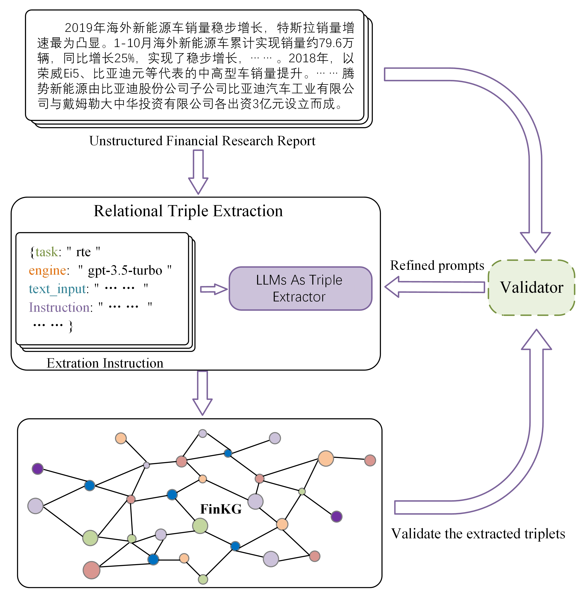
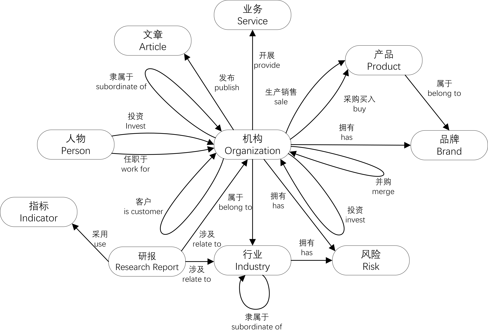
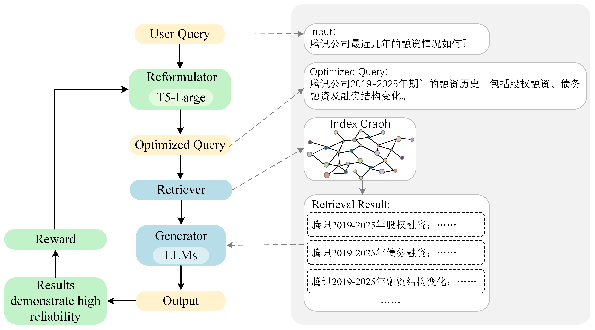

# FinRAG: A Chinese Financial Event Knowledge Graph-Based Retrieval-Augmented Generation Framework for Financial Question Answering


## Overall Framework
FinRAG, a Retrieval-Augmented Generation framework based on a Chinese financial event knowledge graph(see Fig.1). The framework first combines semantic-aware chunking and large language model(LLM)-based triplet extraction to construct a structured index, which enhances retrieval efficiency and supports accurate financial event reasoning. The framework incorporates a generation-verification process to ensure reliable and relevant information retrieval. Then, a query reconstruction module based on reinforcement learning is designed to convert vague user queries into domain-specific expressions, significantly improving intent recognition accuracy. 
Finally, we design a dual-level retrieval mechanism inspired by LightRAG, and adapt it to the financial domain. The first level retrieves core entities based on semantic similarity, while the second level completes event chains through knowledge graph–based neighbor expansion.
Experimental results demonstrate that the proposed framework outperforms general RAG baselines on a self-constructed Chinese financial question answering dataset.

<p align="center">
  
</p>
<p align="center">
Figure 1: Overview of the FinRAG framework.
</p>

## Key Features

- 🏦 **Domain-Specialized** - Optimized for complex Chinese financial terminology and multi-source data
- 🧠 **Knowledge Graph Integration** - Combines 1,200 professional research reports with structured event knowledge
- 🔍 **Dual-Level Retrieval** - Semantic similarity search + knowledge graph expansion
- ✅ **Generation-Verification** - Ensures reliable outputs through link prediction
- 🚀 **Query Reconstruction** - RL-based transformation of vague queries into domain-specific expressions

## 📊 Dataset 📊

| Component | Quantity | Content Types |
|-----------|----------|---------------|
| Research Reports | 1,200 | Company analyses, Industry research, Macroeconomic evaluations |
| QA Pairs | 3,600 | Single-hop, Multi-hop, Open-ended questions |

All content curated by financial experts and knowledge graph engineers.

## Knowledge Graph-Enhanced Structured Index Construction
In Retrieval-Augmented Generation (RAG) systems, documents within the external knowledge base are typically sourced from a wide variety of formats. In the financial domain, such documents may include unstructured text files such as HTML, PDF, and TXT. These heterogeneous formats often contain redundant or irrelevant information, which can negatively impact the performance of the RAG system. Specifically, unprocessed documents may reduce retrieval efficiency, cause the generated responses from large language models (LLMs) to lack coherence, and impair the models’ reasoning capabilities \citep{li2023cfgpt}. To address this, we propose a knowledge graph-enhanced structured index construction module. Its workflow is illustrated in Fig.2.

<p align="center">
  
</p>
<p align="center">
Figure 2: Structured Index Construction Process.
</p>

### Step1:Document Preprocessing and Semantic-aware Chunking
For the external financial documents provided by users, this module first performs textualization, such as extracting readable content from PDFs and removing HTML tags to retain only the text. Subsequently, to accommodate the limited context window of LLMs, the documents are segmented into manageable chunks. Traditional chunking methods based on fixed-length windows or token counts often struggle to detect subtle semantic shifts within the text. 

### Step2:Schema-Guided Triplet Extraction with Generation and Verification
Once the document is segmented, we employ a generation-verification-based method to extract structured financial event triplets, which aims to obtain financial entities and relations from Chinese financial research reports. The generation module, built on prompt engineering for large language models, leverages the contextual learning ability of LLMs to extract structured financial event triplets from the reports, forming an initial knowledge graph. The verification module utilizes the RuleHub rule base to detect and correct errors in the generated triplets. The generation and verification processes are performed iteratively until the output passes validation or a maximum number of iterations is reached. The method architecture is illustrated in Fig.3.

<p align="center">
  
</p>
<p align="center">
Figure 3: A Generation-Verification-Based Method for Chinese Financial Event Triplet Extraction.
</p>

To standardize extraction, we design a schema to provide ontology-based constraints. The schema includes 10 entity types and 19 relation types. The 10 entity types are: Person, Industry, Business, Product, Research Report, Organization, Risk, Article, Indicator, and Brand. The 19 relation types are shown in Fig.4. This schema is specifically designed around financial scenarios and can provide valuable information for tasks such as financial risk analysis, equity penetration, and supply chain mining. For Chinese financial event triplet extraction, we define a prompt as illustrated in Fig.5. In the prompt, \{entity\_constraints\} and \{triple\_constraints\} correspond to the 10 entity types and 19 relation types defined in the schema, respectively.

<p align="center">
  
</p>
<p align="center">
Figure 4: Chinese Financial Event Knowledge Graph Schema.
</p>

<p align="center">
  
</p>
<p align="center">
Figure 5: Prompt for Chinese financial event triplet extraction. The original prompt is written in Chinese; an English translation is shown here.
</p>

### Step3:Key-Value Pair Generation for Retrieval Efficiency
During the extraction of financial event triplets, we simultaneously use the LLM to generate a series of Key-Value pairs, where the Key represents an entity or relation to optimize retrieval efficiency, and the Value is a concise summary of the relevant text segments from the knowledge base associated with the Key. These summaries assist the LLM in the subsequent text generation process.

### Step4:Knowledge Graph Embedding Generation
After validating the extracted financial event triplets and Key-Value summaries, we generate embeddings for entities and relations in the knowledge graph to enable efficient similarity search and retrieval. Specifically, we employ a domain-adapted Sentence-BERT model \citep{reimers2019sentence} to encode the textual representations of entities (e.g., names, descriptions) and relations (e.g., relation types, contexts) into dense vectors. These embeddings are pre-computed and stored as the semantic index of the Chinese financial event knowledge graph, which serves as the foundation for the subsequent dual-level retrieval mechanism.

## Reinforcement Learning-Based User Query Reconstruction Module
To enhance the quality of user queries and reduce the gap between user inputs and the retrieved content in the RAG framework, it is essential to align user queries with the retrieval module. In this paper, we propose a user query reconstruction model based on reinforcement learning (as illustrated in Fig.6), which reformulates user queries by leveraging the existing knowledge embedded in the RAG system and the structure of its index. This approach further enhances the system’s adaptability to diverse user queries and improves retrieval performance.

<p align="center">
  
</p>
<p align="center">
Figure 6: User query reconstruction module in FinRAG.
</p>

## Quick Start

### Installation

Python version：==3.10  \
Download the project code via Git：
```bash
git clone https://github.com/chtkg/FinRAG.git
cd FinRAG
```
Configure the environment using the following commands:
```bash
conda create -n myenv python=3.6 -y   # myenv is the name of the virtual environment
conda activate myenv      # activate the virtual environment
pip install -r requirements.txt   # install dependencies
```

### Using Ollama Models

You need to pull model you plan to use and embedding model, for example nomic-embed-text.
This study utilized the open-source large language model **Qwen2.5** and the embedding model **nomic-embed-text**.

### Data Preprocessing
The data preprocessing pipeline is implemented in **preprocess.ipynb**.
```bash
jupyter notebook preprocess.ipynb
```

### Process the questions
Process the questions by batch-reading local financial query files, extracting the specified questions, invoking a locally deployed Qwen2.5 large language model API to generate answers, and saving the results to the corresponding directories.
```bash
jupyter notebook ragflow.ipynb
```

### RAG Pipeline Construction
Build a complete RAG (Retrieval-Augmented Generation) question-answering system based on a local Ollama deployment, and perform retrieval-augmented QA over local text.  \
The workflow includes: document loading → embedding → vector database construction → retrieval → large language model answer generation.
```bash
jupyter notebook rag.ipynb
```

