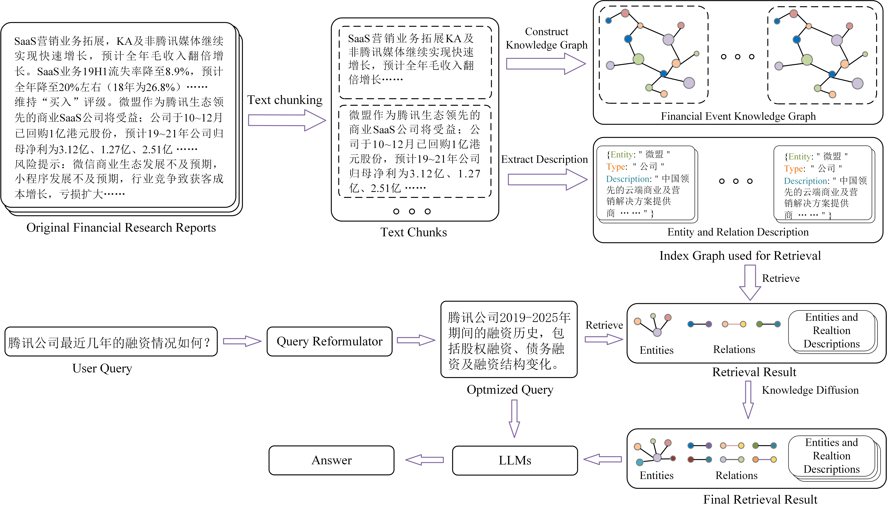
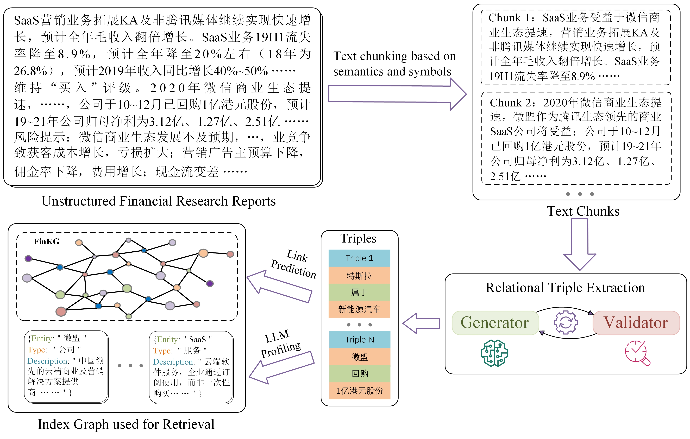

# FinRAG: A Chinese Financial Event Knowledge Graph-Based Retrieval-Augmented Generation Framework for Financial Question Answering


## Overall Framework
FinRAG, a Retrieval-Augmented Generation framework based on a Chinese financial event knowledge graph(see Fig.1). The framework first combines semantic-aware chunking and large language model(LLM)-based triplet extraction to construct a structured index, which enhances retrieval efficiency and supports accurate financial event reasoning. The framework incorporates a generation-verification process to ensure reliable and relevant information retrieval. Then, a query reconstruction module based on reinforcement learning is designed to convert vague user queries into domain-specific expressions, significantly improving intent recognition accuracy. 
Finally, we design a dual-level retrieval mechanism inspired by LightRAG, and adapt it to the financial domain. The first level retrieves core entities based on semantic similarity, while the second level completes event chains through knowledge graph–based neighbor expansion.
Experimental results demonstrate that the proposed framework outperforms general RAG baselines on a self-constructed Chinese financial question answering dataset.

<p align="center">
  
</p>
<p align="center">
Figure 1: Overview of the FinRAG framework.
</p>

## Key Features

- 🏦 **Domain-Specialized** - Optimized for complex Chinese financial terminology and multi-source data
- 🧠 **Knowledge Graph Integration** - Combines 1,200 professional research reports with structured event knowledge
- 🔍 **Dual-Level Retrieval** - Semantic similarity search + knowledge graph expansion
- ✅ **Generation-Verification** - Ensures reliable outputs through link prediction
- 🚀 **Query Reconstruction** - RL-based transformation of vague queries into domain-specific expressions

## 📊 Dataset 📊

| Component | Quantity | Content Types |
|-----------|----------|---------------|
| Research Reports | 1,200 | Company analyses, Industry research, Macroeconomic evaluations |
| QA Pairs | 3,600 | Single-hop, Multi-hop, Open-ended questions |

All content curated by financial experts and knowledge graph engineers.

## Knowledge Graph-Enhanced Structured Index Construction
In Retrieval-Augmented Generation (RAG) systems, documents within the external knowledge base are typically sourced from a wide variety of formats. In the financial domain, such documents may include unstructured text files such as HTML, PDF, and TXT. These heterogeneous formats often contain redundant or irrelevant information, which can negatively impact the performance of the RAG system. Specifically, unprocessed documents may reduce retrieval efficiency, cause the generated responses from large language models (LLMs) to lack coherence, and impair the models’ reasoning capabilities \citep{li2023cfgpt}. To address this, we propose a knowledge graph-enhanced structured index construction module. Its workflow is illustrated in Fig.2.

<p align="center">
  
</p>
<p align="center">
Figure 2: Structured Index Construction Process.
</p>


## Quick Start

### Installation

```bash
git clone https://github.com/chtkg/FinRAG.git
cd FinRAG

